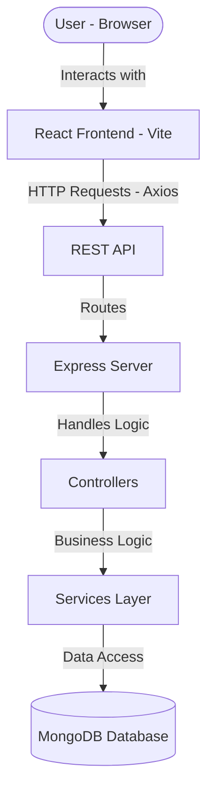

# Pahel - Micro Finance Management System

A comprehensive system for managing micro-finance operations, featuring a React-based frontend and a Node.js/Express backend with MongoDB.

## System Architecture

The following diagram illustrates the high-level architecture and data flow of the Pahel system:



## Project Structure

- `client/`: React frontend built with Vite, Tailwind CSS, and Axios.
- `server/`: Node.js/Express backend with Mongoose for MongoDB integration.

## Deployment Strategy

### Frontend Deployment
- **Platform**: Vercel
- **Build Command**: `npm run build`
- **Output Directory**: `dist`

### Backend Deployment
- **Platform**: Render / Railway
- **Environment**: Node.js
- **Build Command**: `npm install`
- **Start Command**: `npm start`

### Database
- **Platform**: MongoDB Atlas
- **Type**: Managed MongoDB Service

## Financial Analytics & Reporting

The system provides robust financial tracking and reporting capabilities:

- **Loan Portfolio Summary**: Real-time tracking of Active, Closed, Defaulted, and Pending loans.
- **Repayment Analytics**: Automated calculation of outstanding balances and recovery rates.
- **Default Ratio Tracking**: Monitoring of defaulted loans to assess portfolio risk.
- **Monthly Revenue Reports**: Visual trends of collections and disbursements over the last 6 months.
- **Collection Performance Dashboard**:
    - Daily & Monthly collection targets vs. actuals.
    - Overdue loan tracking with penalty calculations.
    - Exportable Daily Collection Reports (PDF & Excel).

## Environment Variables

To run this project, you will need to add the following environment variables to your `.env` files:

### Backend (.env in `/server`)
```env
PORT=5000
MONGO_URI=your_mongodb_atlas_uri
JWT_SECRET=your_jwt_secret
JWT_REFRESH_SECRET=your_jwt_refresh_secret
FRONTEND_URL=your_deployed_frontend_url
BACKEND_URL=your_deployed_backend_url
CLOUD_STORAGE_KEY=your_cloud_storage_key_if_applicable
```

### Frontend (.env in `/client`)
```env
VITE_API_URL=your_backend_api_url/api
VITE_FRONTEND_URL=your_deployed_frontend_url
VITE_BACKEND_URL=your_deployed_backend_url
```

## Getting Started

### Prerequisites
- Node.js (v16+)
- MongoDB

### Installation

1. **Clone the repository**
2. **Backend Setup**
   - Navigate to `server/`
   - Run `npm install`
   - Create a `.env` file based on `.env.example`
   - Run `npm start`
3. **Frontend Setup**
   - Navigate to `client/`
   - Run `npm install`
   - Run `npm run dev`
